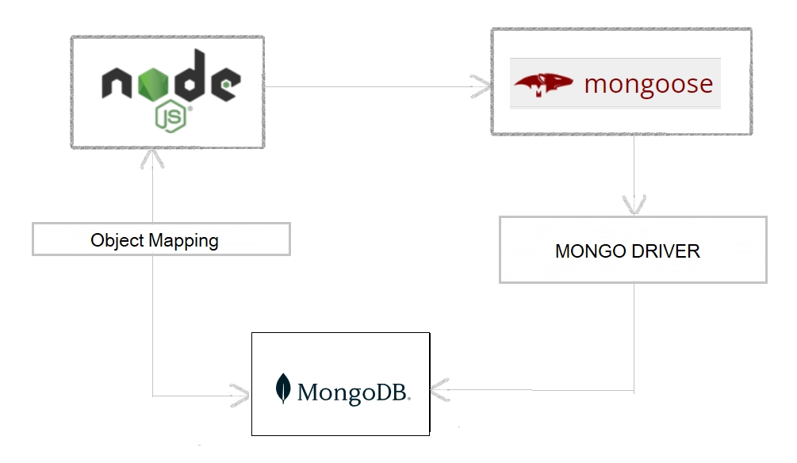

## what is mongoose

Mongoose is an Object Data Modeling (ODM) library for MongoDB and Node.js. It manages relationships between data, provides schema validation, and is used to translate between objects in code and the representation of those objects in MongoDB.

**How mongoose works**


## Terminology 

**Collections**
Collections in Mongo are equivalent to tables in relational databases. They can hold multiple JSON documents.

**Documents**
Documents are equivalent to records or rows of data in SQL. While a SQL row can reference data in other tables, Mongo documents usually combine that in a document.

**Fields**
Fields, also known as properties or attributes, are similar to columns in a SQL table. In the image above, FirstName, LastName, Email, and Phone are all fields.

**Schema**
While Mongo is schema-less, SQL defines a schema via the table definition. A Mongoose schema is a document data structure (or shape of the document) that is enforced via the application layer.

**SchemaTypes**
While Mongoose schemas define the overall structure or shape of a document, SchemaTypes define the expected data type for individual fields (String, Number, Boolean, and so on).
You can also pass in useful options like required to make a field non-optional, default to set a default value for the field, and many more.

**Models**
Models are higher-order constructors that take a schema and create an instance of a document equivalent to records in a relational database.

**Example**
```ts
const puppySchema = new mongoose.Schema({
  name: {
    type: String,
    required: true
  },
  age: Number
});

const Puppy = mongoose.model('Puppy', puppySchema);
```
In the code above, puppySchema defines the shape of the document which has two fields, name, and age.

The SchemaType for name is String and for age is Number. Note that you can define the SchemaType for a field by using an object with a type property like with name. Or you can apply a SchemaType directly to the field like with age.

Also, notice that the SchemaType for name has the option required set to true. To use options like required and lowercase for a field, you need to use an object to set the SchemaType.

At the bottom of the snippet, puppySchema is compiled into a model named Puppy, which can then be used to construct documents in an application.

## setup

* download and install mongodb community server. 
* download and install mongodb compass (It will give a graphic user interface)

**To work with typescript a project, we will do this steps then.**

1. After opening the folder in vs code studio, command: npm init -y
2. install typescript as dev dependencies. command: npm install typescript --save-dev
3. install express. command: npm install express --save
4. install mongoose. command: npm install mongoose --save
5. install ts-node-dev as dev dependencies. command: npm i ts-node-dev --save-dev
6. in package.json, in scripts we will write: "dev": "ts-node-dev --respawn --transpile-only src/server.ts",
7. install cors: command: nmp i cors
7. then to run we will command: npm run dev

**A basic demo**

```ts
const express = require('express')
const mongoose = require('mongoose');

const app = express()
const port = 5000;

// database
async function main() {
     try {
          await mongoose.connect('mongodb://127.0.0.1:27017/test');
          console.log("Database connected successful");
     }catch(err){
          console.log(`Failed to connect database, ${err}`);
     }
   }

main();

app.get('/', (req, res) => {
     res.send('Hello World!')
})

app.listen(port, () => {
     console.log(`Example app listening on port ${port}`)
})
```